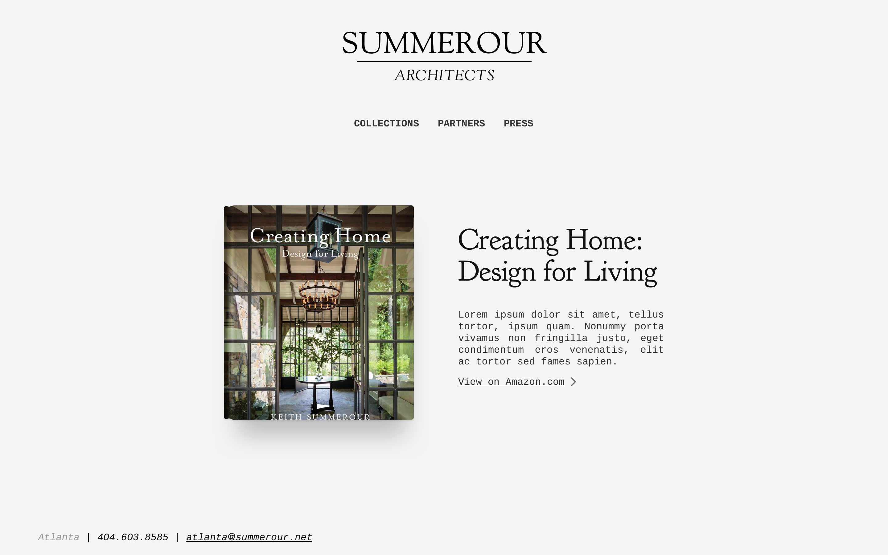
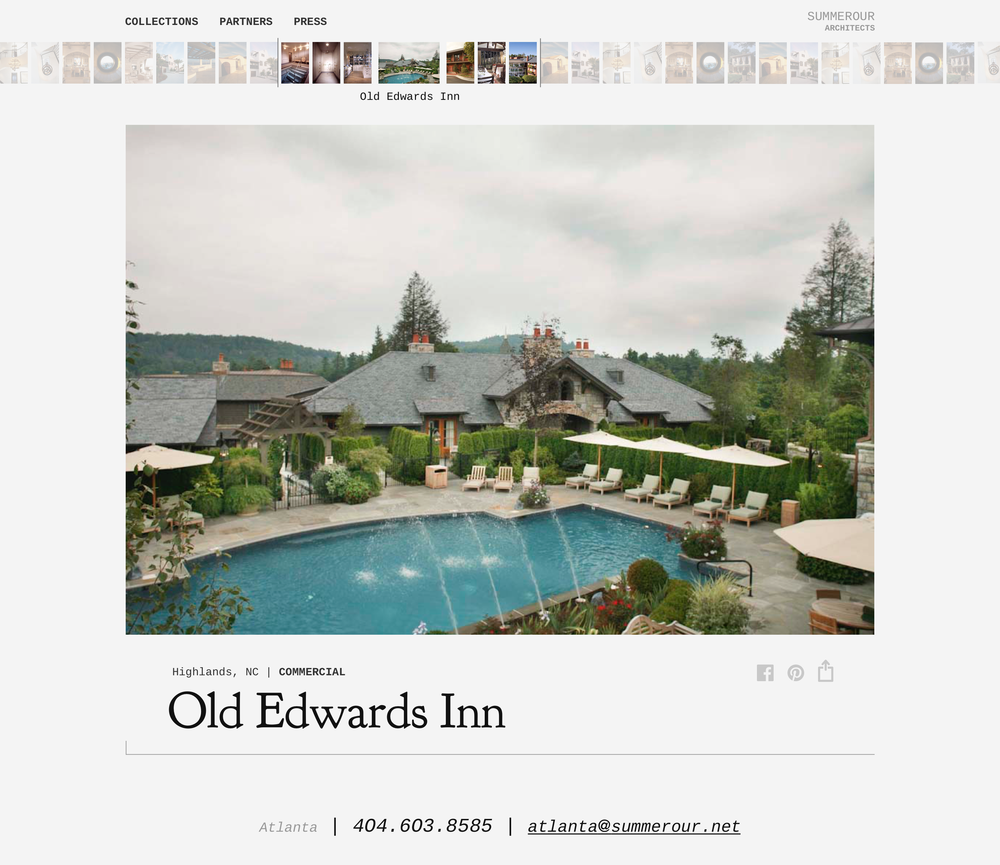

# Second Design Iteration

## Landing Pages

### Default

For the default landing at *summerour.net*, *summerourarchitects.com*, and *keithsummerour.com*, users will be served the following page:

Would love for the background to be a video like on Olson's site. 

You'll notice the use of Goudy in place of Trajan for the logo and titles across the website. Several earlier iterations of this design used the previous font, but I switched to the nearly identical Goudy for three reasons:
1. It is hosted for free on Google Fonts
2. The site will therefore load much faster 
3. I find it much more elegant and geometric

### Book 

When users navigate to *creatinghomedesignforliving.com* they will be given a preview of and link for more information about Keith's book:

Not a huge fan of the monospace body font, but I found it complemented Goudy very well throughout the rest of the design. The answer will be either to remove the body text or to find a tertiary body font for the site

## Project View

Once the user interacts with the landing page, they will be taken immediately to the bulk of the site -- the portfolio:

We see the menu move to the top left corner, the logo transition to a miniature version in the top right, the introduction of the thumbnail slider, and the centering and enlargement of the contact information. The thumbnail slider groups the portfolio into projects, in which only one project is illuminated at a time. As the user scrolls through photos of the same project, the image will slide to change. When the user slides past the end of the project, the image as well as the description will slide to reveal the next or previous project.
